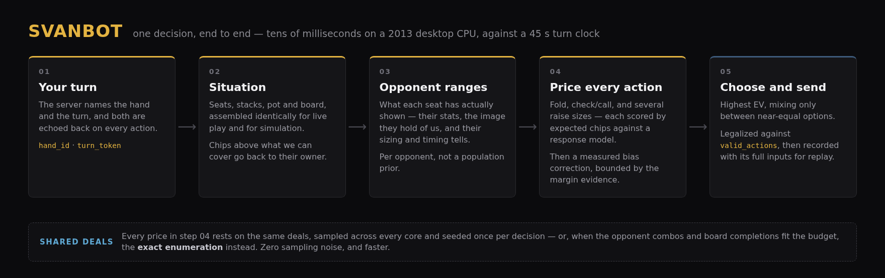
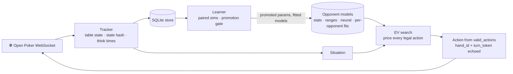
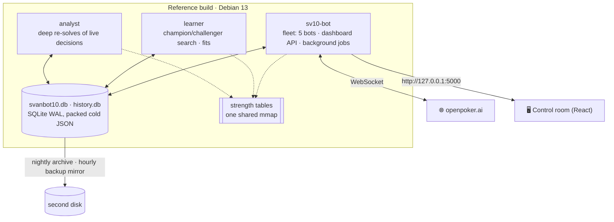
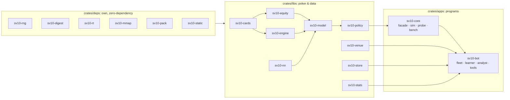
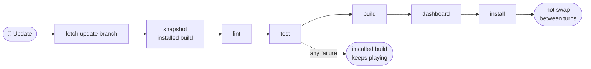

<div align="center">

# ♠️ SvanBot ♥️

### An autonomous, CPU-only poker-bot fleet for [Open Poker](https://openpoker.ai)

**Six-max no-limit hold'em · virtual chips · 14-day seasons · Rust 🦀 + React ⚛️**

[](https://github.com/SvanLabs/SvanBot/actions/workflows/check.yml)

[](#-license)


[**Start here**](#-start-here) ·
[**Highlights**](#-highlights) ·
[**How it decides**](#-how-a-decision-is-made) ·
[**Quick start**](#-quick-start) ·
[**First pull request**](#-your-first-pull-request) ·
[**Docs**](#-documentation)

</div>

> [!WARNING]
> **Everything in this repository is written by AI systems, and every artifact says so.**
> The code, tests, documentation and operational decisions here are produced by AI coding agents
> working under a human operator's direction — and so are the **issues, pull requests and review
> comments**. Every commit, issue and pull request carries a `Generated-by: <tool>/<model>` line
> naming the system that produced it; `AGENTS.md` states the rule and
> [`CONTRIBUTING.md`](CONTRIBUTING.md) §0 states what this project accepts.
> [`AI-PROVENANCE.md`](AI-PROVENANCE.md) is the roster of systems on record, generated from those
> trailers and checked by the gate — and it says there what such a roster does not prove.
>
> Changes pass the automated gate described below, but **no line-by-line human review is
> guaranteed**. Read the code before relying on it, and treat results and claims in the docs as
> measurements to re-check, not guarantees.

<div align="center">



<sub>One decision, end to end: the table state becomes a situation, every legal action is priced
against reconstructed opponent ranges, and the best one is played.</sub>

</div>

---

## 👋 Start here

Find the row that fits you. Each one is a short path, read in order, and says what "done" looks like.

| You want to… | Read, in this order | You are done when… |
|---|---|---|
| 🎮 **Run a fleet** on your own machine | [Quick start](#-quick-start) → [`docs/OPERATIONS.md`](docs/OPERATIONS.md) | the control room at `http://127.0.0.1:5000` shows your bots seated |
| 🔍 **Understand how it plays** | [How a decision is made](#-how-a-decision-is-made) → [`docs/ARCHITECTURE.md`](docs/ARCHITECTURE.md) → [`docs/GUIDE.md`](docs/GUIDE.md) | you can follow one decision from the table state to the action sent |
| 🛠️ **Make your first change** | [Your first pull request](#-your-first-pull-request) → [`CONTRIBUTING.md`](CONTRIBUTING.md) | CI is green on your pull request |
| 🤖 **You are an AI agent** | [`llms.txt`](llms.txt) for the running-it-in-one-command path, then [`AGENTS.md`](AGENTS.md) and the issue you were given | `scripts/check.sh full` passes and your pull request names you |

Not sure which one? The [documentation map](docs/README.md) lists every document with the question
it answers.

---

<a id="highlights"></a>
## ✨ Highlights

SvanBot runs up to five bots on Open Poker from one machine. Each decision is an **exploitative
expected-value search**: every legal action is priced against the ranges each opponent has actually
shown, rather than a precomputed equilibrium. A separate learner keeps tuning the policy on paired,
luck-reduced simulations, and promotes a change only when it wins on fresh deals.

<table>
<tr>
<td width="50%" valign="top">

### 🎯 Exploitative decisions
Monte Carlo EV over every candidate action against reconstructed opponent ranges, using exact
board-strength tables and exact heads-up enumeration where they fit: **67.6 ms at the median and
190 ms at the 95th** on the reference i7-4770K, against a 45 s turn clock — the `live` suite of
`bench` with the fleet paused, ten paired repeats
([`docs/OPERATIONS.md`](docs/OPERATIONS.md)). The live sample budget is scaled to the machine's
measured throughput (`crates/libs/policy/src/hardware.rs`).

</td>
<td width="50%" valign="top">

### 🧠 Opponents it learns
Per-player statistics, and a range model whose constants `calibrate` fits to every stored
showdown and installs only when it beats the defaults on the newest quarter the fit never sees.
The think-time term (`think_exp`) starts at 0 — timing not used — and moves only on a held-out
gain; then an aggressive actor's think time, against their own typical time, tilts their range.
The small neural response model and the per-opponent fold, sizing and call corrections are
installed under the same rule (`crates/apps/bot/src/playerfits.rs`).

</td>
</tr>
<tr>
<td valign="top">

### 📈 A learner that must prove it
Champion/challenger search with successive halving (`crates/apps/bot/src/learner/search.rs`), then
a separate gate that rests on fresh deals alone (`crates/apps/bot/src/promotion.rs`): up to 12
sequential chunks, stopping early for futility or for overwhelming evidence (z ≥ 3), and promotion
needs a **95% lower bound above +1 bb/100**. The search's interval is selection-biased — winner's
curse — so it only selects, and never promotes.

</td>
<td valign="top">

### 🛡️ Safe by construction
It sends only actions the server listed in `valid_actions`, answers each `(hand, turn_token)` at
most once, and takes the check/fold fallback if a decision passes its 8 s cap — the first two held
by tests in `crates/apps/bot/src/client/decide.rs`. The SQLite store carries a SHA-256 sidecar and
hourly backups: a damaged database is quarantined and restored from the newest verified backup
(`crates/libs/store/src/integrity.rs`).

</td>
</tr>
<tr>
<td valign="top">

### 🔄 One-click updates that never stop play
**Update** on the dashboard runs `scripts/update.sh` — fetch, test, build, install, with a live
progress bar — and the fleet hot-swaps to the new binary between turns, so the bots keep playing.
Any verified snapshot is one click away as a rollback (`--rollback <commit>`).

</td>
<td valign="top">

### ⚙️ Tuned for one real machine
Written for an i7-4770K (Haswell, AVX2), 32 GB DDR3, a small SSD and an HDD, with **no GPU**:
- the strength tables are shared memory maps;
- cold JSON is compressed with our own DEFLATE;
- archives and backup mirrors go to the HDD;
- a host-check panel spots drift.

</td>
</tr>
</table>

### 📊 At a glance (measured)

Every number below is a measured engineering result with a reproducible command behind it — see
[`docs/OPERATIONS.md`](docs/OPERATIONS.md). None of them is a claim about winnings.

| | |
|---|---|
| ⏱️ Decision latency | Tens of ms at the median, 8 s hard cap, legal fallback always ready |
| 🃏 Hand evaluator | ~24 ns per 7-card hand, verified on all 133,784,560 hands |
| 💾 Databases | 1.8 GB → 0.7 GB with the own DEFLATE codec (zlib-equal ratio), identical reads |
| 🧮 Memory | Strength tables mapped read-only: 92 MB of private heap per process → one shared page-cache copy |
| 🧪 Tests | 562 Rust tests across 26 binaries, plus 12 Playwright specs; an edit re-tests in seconds |
| 🎮 GPUs needed | 0 |

---

<a id="decision"></a>
## 🧭 How a decision is made



1. **Track.** The WebSocket client keeps the table state and verifies the server's state hash.
2. **Situate.** On your turn, the state becomes a *situation*: seats, stacks, pot and board.
3. **Price.** Each opponent's range is rebuilt from their stats, our table image and their sizing and
   timing tells, and the EV search prices every legal action against it.
4. **Act.** The best action is sent — always one the server listed in `valid_actions`, always with
   its `hand_id` and `turn_token`.
5. **Learn.** Hands land in the store; the learner, a separate process, tunes the policy and
   promotes a change only after it wins on fresh deals.

[`docs/ARCHITECTURE.md`](docs/ARCHITECTURE.md) walks the full path, the processes and the
invariants.

<a id="architecture"></a>
## 🏗️ Architecture

<details open>
<summary><b>Processes</b>: what runs on the box</summary>



</details>

<details>
<summary><b>Crates</b>: three layers, own foundations first</summary>



</details>

**Where things live** — a change belongs in exactly one of these:

| Path | What is there | Go here to… |
|---|---|---|
| `crates/deps/` | Our own zero-dependency foundations: RNG, SHA-256/HMAC, runtime helpers, file maps, DEFLATE | replace a third-party crate |
| `crates/libs/` | The poker and data libraries: cards, equity, rules engine, opponent models, policy, statistics, protocol tracker, store | change how the bot thinks or what it stores |
| `crates/apps/core` | Re-exports the libraries as `sv10_core::*`; the `sim`, `probe`, `bench` and `tables` tools | run a simulation or a benchmark |
| `crates/apps/bot` | The fleet binary (WebSocket clients, dashboard API, background jobs), learner, analyst and review tools | change anything that touches the network, the database or the clock |
| `web/` | The control room (Vite + React + TypeScript), served by the fleet binary | change the dashboard; its API contract is `web/src/types.ts` |
| `scripts/` | Setup, the check gate, release with hot swap, update, start and stop, backups, monitoring | change how it is built, checked or run |
| `docs/` | Architecture, runbook, specs and lessons — see the [documentation map](docs/README.md) | find out why something is the way it is |

<details>
<summary><b>On the names</b>: SvanBot, <code>sv10-*</code> and <code>svanbot10</code></summary>

The project is **SvanBot**, and the crates keep their `sv10-` prefix while the binaries stay
`sv10-bot`, `learner` and `analyst`. Some files also keep the older `svanbot10` spelling —
`svanbot10.db`, `scripts/svanbot10.service`. They are stable identifiers: renaming them would be a
large mechanical diff that buys nothing, and renaming a database file is a migration rather than a
rename.

</details>

---

<a id="quick-start"></a>
## 🚀 Quick start

**You need:** Linux x86-64 (x86-64-v2 or newer) · Rust 1.98.1 (pinned in
[`rust-toolchain.toml`](rust-toolchain.toml)) · Node 26 for the dashboard · `zstd` and `cargo-deny`
· an Open Poker API key · **no GPU**.

1. **Set up.** Checks the toolchain, creates `.env` (mode 600) from `.env.example`, and builds.

   ```sh
   scripts/setup.sh
   ```

2. **Add your key.** Put your Open Poker API key(s) in `.env`. It is gitignored, and the pre-commit
   hook refuses a commit that contains a key.

3. **Run the gate.** The same checks CI runs; it should end green.

   ```sh
   scripts/check.sh full
   ```

4. **Build, install and start** the fleet, the learner and the dashboard.

   ```sh
   scripts/release.sh
   scripts/start.sh
   ```

5. **Open the control room** at `http://127.0.0.1:5000` and watch each bot connect and take a seat.

After that, `scripts/status.sh` and `scripts/stop.sh` do what they say, and `scripts/units.sh`
installs the systemd user units — rendered for wherever you cloned this — so `svanbot10.service`
keeps the fleet running across reboots. The runbook for everything else — updates, backups, fault
drills — is [`docs/OPERATIONS.md`](docs/OPERATIONS.md).

> [!IMPORTANT]
> **Building while a fleet is running?** Use `CARGO_TARGET_DIR=target/dev`. A release build lands
> in the directory the live processes hot-swap from, so building there swaps untested code into a
> running bot.

<a id="update"></a>
<details>
<summary><b>🔄 One-click update</b>: how the Update button stays safe</summary>

Click **Update** in the dashboard's System view; a stage-weighted progress bar shows every step
while the bots keep playing.



A failed run changes nothing, and the checkout returns to where it was. **Roll back to a saved
build** uses the same bar. `scripts/update.sh` does the same from a terminal.

The button fast-forwards the checkout onto **one branch**: `SVANBOT_UPDATE_BRANCH`, `main` by
default. `main` is the default branch and the released line, so a fresh `git clone` lands on it and
keeps updating from it, and every merge reaches live play at the next Update. An install that must
not follow the released line — a staging box, a fork — sets `SVANBOT_UPDATE_BRANCH=<branch>` in
`.env` to follow that branch instead.

</details>

<details>
<summary><b>⚙️ Configuration</b>: the settings most operators touch</summary>

All settings live in `.env` (gitignored, mode 600; see `.env.example`).

| Variable | Meaning | Default |
|---|---|---|
| `SVANBOT_WEB__HOST` | Dashboard bind address | `127.0.0.1` |
| `SVANBOT_WEB_PORT` | Dashboard port | `5000` |
| `SVANBOT_WEB__OPERATOR_TOKEN` | Required before the dashboard is reachable from other machines | unset |
| `SVANBOT_UPDATE_BRANCH` | Branch the Update button fetches and fast-forwards to | `main` |
| `SVANBOT_ARCHIVE_DIR` | Second-disk directory for archives and the hourly backup mirror | `artifacts/archive` |

Without an operator token the dashboard accepts changes only on a loopback address. Runtime data —
databases, archives, screenshots — is **not** in this repository; `scripts/fetch-data.sh` restores
it from an archive you supply.

</details>

---

<a id="first-pull-request"></a>
## 🛠️ Your first pull request

You are welcome here, and **you are expected to bring an agent**. Every change in this repository
is made by an AI coding agent that a person directs — Claude Code, Codex, Aider, whichever you use —
and hand-written contributions are declined however good they are ([`CONTRIBUTING.md`](CONTRIBUTING.md) §0).
Directing the agent well is the contribution.

1. **Pick an issue.** Start with
   [**good first issue**](https://github.com/SvanLabs/SvanBot/issues?q=is%3Aissue+is%3Aopen+label%3A%22good+first+issue%22)
   or [**agent-friendly**](https://github.com/SvanLabs/SvanBot/issues?q=is%3Aissue+is%3Aopen+label%3Aagent-friendly).
   Each one says where the problem is, why it matters, and the fix it expects. Issues labelled
   `blocked-on-decision` wait on a maintainer's choice first; the
   [board](https://github.com/orgs/SvanLabs/projects/1) shows every open issue by readiness.
2. **Fork, and make a short-lived branch off `main`** named for the change —
   `fix/split-pots-all-folded`, `docs/…`. `main` is the default branch and the released line, and
   every pull request goes into it, so the base needs no setting.
3. **Hand your agent [`AGENTS.md`](AGENTS.md) and the issue.** `AGENTS.md` is the brief: where
   code goes, the two hard invariants, and everything the gate enforces.
4. **Run the gate** before you push. It is the same command CI runs, so a green run here is a green
   run there.

   ```sh
   scripts/check.sh full
   ```

5. **Open the pull request.** The template asks for three things: what generated it
   (`Generated-by: <tool>/<model>`, also in every commit footer), why, and what changed.

CI runs the gate on every pull request. Pull requests from this repository's own branches also get
an automatic Claude review, and collaborators can mention **@claude** in a comment to ask for a fix
or an explanation.

<details>
<summary><b>🧑‍💻 Everyday development commands</b></summary>

```sh
export CARGO_TARGET_DIR=target/dev   # never build into target/release while the fleet runs
python3 scripts/test.py              # every workspace test, in parallel (seconds after an edit)
python3 scripts/test.py <filter>     # just the tests you touched
scripts/check.sh commit              # what the pre-commit hook runs: markers, secrets, fmt, clippy, golden
scripts/check.sh full                # plus cargo-deny, docs drift, every workspace test and the dashboard's tsc
cd web && npm run build              # dashboard production build
```

Ground rules, each learned the hard way ([`docs/LESSONS.md`](docs/LESSONS.md) has the full list):

- **Every behaviour change passes a paired simulation on identical cards** before it ships; changes
  that do not clearly win ship as learner knobs that are off by default.
- **Speed-only changes reproduce the reference sim exactly**; intended behaviour changes regenerate
  the golden snapshot (`crates/apps/core/tests/golden/core.json`) on purpose. Never regenerate it to
  make a red test go green.
- **Errors are never swallowed**: a failed store read keeps what is installed and logs once, and a
  dashboard panel says when its data is stale.
- **No placeholders**: clippy denies `todo!`, `unimplemented!` and `dbg!`, and the gate refuses
  marker comments.
- **Deploy with `scripts/release.sh` (or the Update button) only**: it builds, tests and hot-swaps
  between turns.

</details>

---

<a id="docs"></a>
## 📚 Documentation

| You want to… | Read |
|---|---|
| Point an AI agent at this repository | 🤖 [`llms.txt`](llms.txt) — the whole project in one page, written for a model to act on |
| See every document and the question it answers | 🗺️ [`docs/README.md`](docs/README.md) — the documentation map |
| See which AI systems are on record for this repository | 🏷️ [`AI-PROVENANCE.md`](AI-PROVENANCE.md) — the roster, generated from the commit trailers |
| Run, update, back up or troubleshoot a fleet | 🧰 [`docs/OPERATIONS.md`](docs/OPERATIONS.md) |
| Use the control room and understand what it shows | 📖 [`docs/GUIDE.md`](docs/GUIDE.md) — also the dashboard's `/docs` page |
| Understand the processes, the crates and the decision path | 🏛️ [`docs/ARCHITECTURE.md`](docs/ARCHITECTURE.md) |
| Know why a rule exists before you change it | 📝 [`docs/LESSONS.md`](docs/LESSONS.md) |
| Look up a term — flagship bot, fleet, season record | 📘 [`CONTEXT.md`](CONTEXT.md) |
| Work on the protocol, the store, the learner or the dashboard API | 🔌 [`SPEC-protocol`](docs/SPEC-protocol.md) · 💾 [`SPEC-data`](docs/SPEC-data.md) · 🧠 [`SPEC-learner`](docs/SPEC-learner.md) · 🖥️ [`SPEC-dashboard`](docs/SPEC-dashboard.md) |
| Cut a release | 📦 [`docs/RELEASE.md`](docs/RELEASE.md) |
| Ask a question or report a vulnerability | 💬 [`SUPPORT.md`](SUPPORT.md) · 🔒 [`SECURITY.md`](SECURITY.md) |

## ♟️ Fair play

Open Poker's rules apply, and this software is built to stay inside them:

- one public bot on a free account, and up to five portfolio bots on Pro;
- bots from the same owner never share a table;
- no collusion, no chip dumping, no extra accounts.

API keys stay out of source control, and the pre-commit hook refuses them.

## 📄 License

Dual-licensed under [MIT](LICENSE-MIT) or [Apache 2.0](LICENSE-APACHE), at your option.
Third-party components are listed in [`THIRD-PARTY-NOTICES.md`](THIRD-PARTY-NOTICES.md).

<div align="center">
<sub>♣️ Built to top the leaderboard by maximising expected chips, through the gates, never by gambling. ♦️</sub>
</div>
