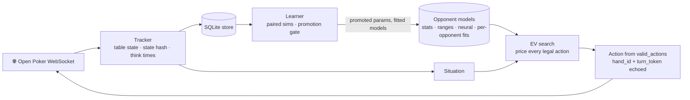
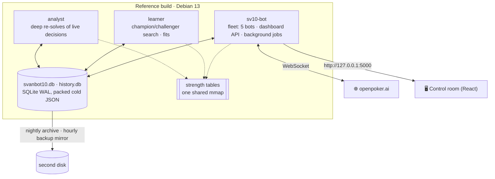
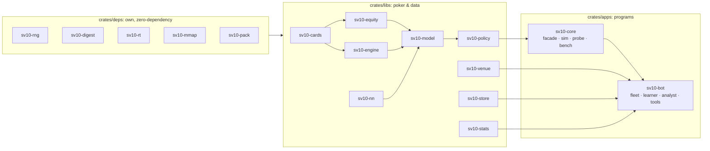
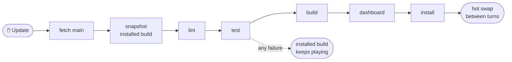

<div align="center">

# ♠️ SvanBot ♥️

### An autonomous, CPU-only poker-bot fleet for [Open Poker](https://openpoker.ai)

**Six-max no-limit hold'em · virtual chips · 14-day seasons · Rust 🦀 + React ⚛️**

[](https://github.com/SvanLabs/SvanBot/actions/workflows/check.yml)

[](#-license)


[**Highlights**](#-highlights) ·
[**How it decides**](#-how-a-decision-is-made) ·
[**Architecture**](#-architecture) ·
[**Quick start**](#-quick-start) ·
[**Documentation**](#-documentation) ·
[**Contributing**](#-contributing)

</div>

> [!WARNING]
> **Everything in this repository is written by AI systems, and every artifact says so.**
> The code, tests, documentation and operational decisions here are produced by AI coding agents
> working under a human operator's direction — and so are the **issues, pull requests and review
> comments**. Every commit, issue and pull request carries a `Generated-by: <tool>/<model>` line
> naming the system that produced it; `AGENTS.md` states the rule and
> [`CONTRIBUTING.md`](CONTRIBUTING.md) §0 states what this project accepts.
>
> Changes pass the automated gate described below, but **no line-by-line human review is
> guaranteed**. Read the code before relying on it, and treat results and claims in the docs as
> measurements to re-check, not guarantees.

<div align="center">


<sub>One decision, end to end: the table state becomes a situation, every legal action is priced
against reconstructed opponent ranges, and the best one is played.</sub>

</div>

---

<a id="highlights"></a>
## ✨ Highlights

SvanBot runs up to five bots on Open Poker from one machine. Each decision is an **exploitative
expected-value search**: every legal action is priced against the ranges each opponent has actually
shown, rather than a precomputed equilibrium. A separate learner keeps tuning the policy on paired,
luck-reduced simulations, and promotes a change only when it wins on fresh deals.

<table>
<tr>
<td width="50%" valign="top">

### 🎯 Exploitative decisions
Monte Carlo EV over every candidate action against reconstructed opponent ranges: **tens of
milliseconds at the median, a few hundred at the 95th**, against a 45 s turn clock. It uses exact
board-strength tables and exact heads-up enumeration where they fit.

</td>
<td width="50%" valign="top">

### 🧠 Opponents it learns
Per-player statistics and a showdown-fitted range model, which sharpens after big bets and can
use think-time tells. On top: a small neural response model, and per-opponent fold, sizing and
call corrections. Every one of them is **installed only while it beats its baseline on held-out
data**.

</td>
</tr>
<tr>
<td valign="top">

### 📈 A learner that must prove it
Champion/challenger search with successive halving. Promotion needs a **95% lower bound above
+1 bb/100** in sequential fresh-deal confirmation; winner's-curse optimism never ships.

</td>
<td valign="top">

### 🛡️ Safe by construction
It only ever sends actions from the server's `valid_actions`, answers each turn once, and has a
legal fallback prepared before every calculation. The SQLite store is integrity-checked, with
sealed backups, quarantine and restore.

</td>
</tr>
<tr>
<td valign="top">

### 🔄 One-click, zero-downtime updates
**Update** on the dashboard fetches, tests, builds and installs with a live progress bar. The bots
keep playing and **hot-swap between turns**. Any saved build is one click away as a rollback.

</td>
<td valign="top">

### ⚙️ Tuned for one real machine
Written for an i7-4770K (Haswell, AVX2), 32 GB DDR3, a small SSD and an HDD, with **no GPU**:
- the strength tables are shared memory maps;
- cold JSON is compressed with our own DEFLATE;
- archives and backup mirrors go to the HDD;
- a host-check panel spots drift.

</td>
</tr>
</table>

### 📊 At a glance (measured)

Every number below is a measured engineering result with a reproducible command behind it — see
[`docs/OPERATIONS.md`](docs/OPERATIONS.md). None of them is a claim about winnings.

| | |
|---|---|
| ⏱️ Decision latency | Tens of ms at the median, 8 s hard cap, legal fallback always ready |
| 🃏 Hand evaluator | ~24 ns per 7-card hand, verified on all 133,784,560 hands |
| 💾 Databases | 1.8 GB → 0.7 GB with the own DEFLATE codec (zlib-equal ratio), identical reads |
| 🧮 Memory | Strength tables mapped read-only: 92 MB of private heap per process → one shared page-cache copy |
| 🧪 Tests | 562 Rust tests across 26 binaries, plus 12 Playwright specs; an edit re-tests in seconds |
| 🎮 GPUs needed | 0 |

---

<a id="decision"></a>
## 🧭 How a decision is made



[`docs/ARCHITECTURE.md`](docs/ARCHITECTURE.md) walks the full path, the processes and the
invariants.

<a id="architecture"></a>
## 🏗️ Architecture

<details open>
<summary><b>Processes</b>: what runs on the box</summary>



</details>

<details>
<summary><b>Crates</b>: three layers, own foundations first</summary>



| Path | Contents |
|---|---|
| `crates/deps/` (`rng`, `digest`, `rt`, `mmap`, `pack`) | Our own zero-dependency foundations: seedable RNG, SHA-256/HMAC, runtime helpers, shared read-only file maps, DEFLATE compression |
| `crates/libs/` (`cards`, `equity`, `engine`, `nn`) | Verified 7-card evaluator, equity and board-strength tables, multiway rules engine, MLP |
| `crates/libs/` (`model`, `policy`, `stats`) | Opponent statistics, range reconstruction and calibration, the EV policy, agents and the paired simulator, shared statistics |
| `crates/libs/` (`venue`, `store`) | Protocol tracker, SQLite store (compressed cold columns, integrity checks, archives) |
| `crates/apps/core` | Re-exports the poker crates as `sv10_core::*`; `sim`, `probe`, `bench` and `tables` tools |
| `crates/apps/bot` | The fleet binary (WebSocket clients, dashboard API, background jobs), learner, analyst, review, replay, calibration, ingest and archive tools |
| `web/` | Control-room dashboard (Vite + React + TypeScript), served by the fleet binary |
| `docs/` | Architecture, operations runbook, protocol/data/learner/dashboard specs, lessons learned |
| `scripts/` | Setup, the check gate, release with hot swap, update, start/stop, backups, monitoring |

**On the names.** The project is **SvanBot**, and the crates keep their `sv10-` prefix while the
binaries stay `sv10-bot`, `learner` and `analyst`. Some files also keep the older `svanbot10`
spelling — `svanbot10.db`, `scripts/svanbot10.service`. Renaming them would be a large mechanical
diff that buys nothing; they are stable identifiers, and renaming a database file is a migration
rather than a rename.

</details>

---

<a id="quick-start"></a>
## 🚀 Quick start

**Requirements:** Linux x86-64 (x86-64-v2 or newer) · Rust 1.98.1 (pinned in
[`rust-toolchain.toml`](rust-toolchain.toml)) · Node 26 for the dashboard · `zstd` for archives and
`cargo-deny` for the licence checks · **no GPU**

```sh
scripts/setup.sh            # toolchain check, creates .env (mode 600) from .env.example, builds
$EDITOR .env                # add your Open Poker API key(s)
scripts/check.sh full       # the anti-regression gate
scripts/release.sh          # build, test, install into target/release
scripts/start.sh            # fleet, learner and dashboard on http://127.0.0.1:5000
```

`scripts/status.sh` and `scripts/stop.sh` do what they say, and a systemd user unit
(`scripts/svanbot10.service`) keeps the fleet running across reboots.

> **Building while a fleet is running?** Use `CARGO_TARGET_DIR=target/dev`. A release build lands
> in the directory the live processes hot-swap from, so building there swaps untested code into a
> running bot.

<a id="update"></a>
### 🔄 One-click update

Click **Update** in the dashboard's System view; a stage-weighted progress bar shows every step
while the bots keep playing.



A failed run changes nothing, and the checkout returns to where it was. **Roll back to a saved
build** uses the same bar. `scripts/update.sh` does the same from a terminal.

---

<details>
<summary><b>🛠️ Development</b></summary>

```sh
export CARGO_TARGET_DIR=target/dev   # never build into target/release while the fleet runs
python3 scripts/test.py              # every workspace test, in parallel (seconds after an edit)
scripts/check.sh commit              # what the pre-commit hook runs: markers, secrets, fmt, clippy, golden
scripts/check.sh full                # plus cargo-deny, docs drift, every workspace test and the dashboard's tsc
cd web && npm run build              # dashboard production build
```

Ground rules, each learned the hard way ([`docs/LESSONS.md`](docs/LESSONS.md) has the full list):

- **Every behaviour change passes a paired simulation on identical cards** before it ships; changes
  that do not clearly win ship as learner knobs that are off by default.
- **Speed-only changes reproduce the reference sim exactly**; intended behaviour changes regenerate
  the golden snapshot (`crates/apps/core/tests/golden/core.json`) on purpose. Never regenerate it to
  make a red test go green.
- **Errors are never swallowed**: a failed store read keeps what is installed and logs once, and a
  dashboard panel says when its data is stale.
- **No placeholders**: clippy denies `todo!`, `unimplemented!` and `dbg!`, and the gate refuses
  marker comments.
- **Deploy with `scripts/release.sh` (or the Update button) only**: it builds, tests and hot-swaps
  between turns.

</details>

<details>
<summary><b>⚙️ Configuration</b></summary>

All settings live in `.env` (gitignored, mode 600; see `.env.example`). The ones most operators
touch:

| Variable | Meaning | Default |
|---|---|---|
| `SVANBOT_WEB__HOST` | Dashboard bind address | `127.0.0.1` |
| `SVANBOT_WEB_PORT` | Dashboard port | `5000` |
| `SVANBOT_WEB__OPERATOR_TOKEN` | Required before the dashboard is reachable from other machines | unset |
| `SVANBOT_ARCHIVE_DIR` | Second-disk directory for archives and the hourly backup mirror | `artifacts/archive` |

Without an operator token the dashboard accepts changes only on a loopback address. Runtime data —
databases, archives, screenshots — is **not** in this repository; `scripts/fetch-data.sh` restores
it from an archive you supply.

</details>

---

<a id="docs"></a>
## 📚 Documentation

| Document | Covers |
|---|---|
| 🏛️ [`docs/ARCHITECTURE.md`](docs/ARCHITECTURE.md) | Processes, crates, the decision path, invariants |
| 🧰 [`docs/OPERATIONS.md`](docs/OPERATIONS.md) | Runbook, benchmarks, fault drills, host checklist |
| 📖 [`docs/GUIDE.md`](docs/GUIDE.md) | The user guide, also served by the dashboard's `/docs` page |
| 🔌 [`docs/SPEC-protocol.md`](docs/SPEC-protocol.md) | The Open Poker WebSocket protocol as implemented |
| 💾 [`docs/SPEC-data.md`](docs/SPEC-data.md) | Store schema, compressed columns, archives, integrity |
| 🧠 [`docs/SPEC-learner.md`](docs/SPEC-learner.md) | Champion/challenger search and the promotion gate |
| 🖥️ [`docs/SPEC-dashboard.md`](docs/SPEC-dashboard.md) | Dashboard API and panels |
| 📦 [`docs/RELEASE.md`](docs/RELEASE.md) | Release checklist |
| 📝 [`docs/LESSONS.md`](docs/LESSONS.md) | Mistakes already paid for, each with a standing rule |

`CONTEXT.md` is the domain glossary — what "flagship bot", "fleet" and "season record" mean here.

<a id="contributing"></a>
## 🤝 Contributing

You are welcome, and **you are expected to bring an agent.** This repository does not accept
hand-written contributions, however good: every artifact in it is machine-generated and carries a
`Generated-by:` line naming the system that produced it. Directing an agent is exactly how
contributions are made here — see [`CONTRIBUTING.md`](CONTRIBUTING.md) §0.

[`AGENTS.md`](AGENTS.md) is the short brief an agent should read first, and it is the one file
every major coding agent already looks for. `docs/LESSONS.md` explains why the rules are what they
are, which is usually the difference between a change that is accepted and one that is not.

**Before you open a pull request:** run `scripts/check.sh full`. It is the same command CI runs, so
a red run locally and a red run in CI are the same failure with the same fix.

## ♟️ Fair play

Open Poker's rules apply, and this software is built to stay inside them:

- one public bot on a free account, and up to five portfolio bots on Pro;
- bots from the same owner never share a table;
- no collusion, no chip dumping, no extra accounts.

API keys stay out of source control, and the pre-commit hook refuses them.

## 📄 License

Dual-licensed under [MIT](LICENSE-MIT) or [Apache 2.0](LICENSE-APACHE), at your option.
Third-party components are listed in [`THIRD-PARTY-NOTICES.md`](THIRD-PARTY-NOTICES.md).

<div align="center">
<sub>♣️ Built to top the leaderboard by maximising expected chips, through the gates, never by gambling. ♦️</sub>
</div>
